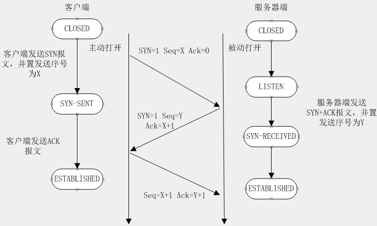
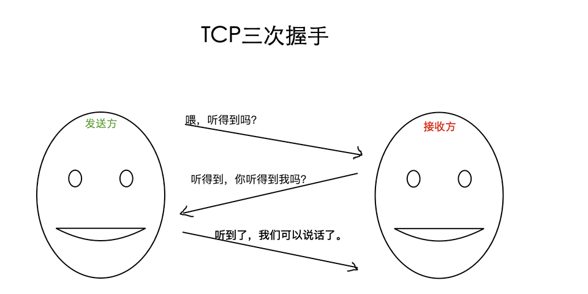

**HTTP**（HyperText Transfer Protocol：超文本传输协议）是一种用于分布式、协作式和超媒体信息系统的应用层协议。 简单来说就是一种发布和接收 HTML 页面的方法，被用于在 Web 浏览器和网站服务器之间传递信息。

HTTP 默认工作在 TCP 协议 `80 端口`，用户访问网站**http://**打头的都是标准 HTTP 服务。

**HTTP 协议以明文方式发送内容，不提供任何方式的数据加密，如果攻击者截取了Web浏览器和网站服务器之间的传输报文，就可以直接读懂其中的信息，因此，HTTP协议不适合传输一些敏感信息，比如：信用卡号、密码等支付信息。**

**HTTPS**（Hypertext Transfer Protocol Secure：超文本传输安全协议）是一种透过计算机网络进行安全通信的传输协议。
**HTTPS 经由 HTTP 进行通信，但利用 SSL/TLS 来加密数据包。**

HTTPS 开发的主要目的，是`提供对网站服务器的身份认证，保护交换数据的隐私与完整性`。

HTTPS 默认工作在 TCP 协议443端口，它的工作流程一般如以下方式：
- **1、TCP 三次同步握手**
- **2、客户端验证服务器数字证书**
- **3、DH 算法协商对称加密算法的密钥、hash 算法的密钥**
- **4、SSL 安全加密隧道协商完成**
- **5、网页以加密的方式传输，用协商的对称加密算法和密钥加密，保证数据机密性；用协商的hash算法进行数据完整性保护，保证数据不被篡改。**

### HTTP 与 HTTPS 区别
- HTTP 明文传输，数据都是未加密的，安全性较差，HTTPS（SSL+HTTP） 数据传输过程是加密的，安全性较好。
- 使用 HTTPS 协议需要到 CA（Certificate Authority，数字证书认证机构） 申请证书，一般免费证书较少，因而需要一定费用。证书颁发机构如：Symantec、Comodo、GoDaddy 和 GlobalSign 等。
- HTTP 页面响应速度比 HTTPS 快，主要是因为 HTTP 使用 TCP 三次握手建立连接，客户端和服务器需要交换 3 个包，而 HTTPS除了 TCP 的三个包，还要加上 ssl 握手需要的 9 个包，所以一共是 12 个包。
- http 和 https 使用的是完全不同的连接方式，用的端口也不一样，前者是 80，后者是 443。
- HTTPS 其实就是建构在 SSL/TLS 之上的 HTTP 协议，所以，要比较 HTTPS 比 HTTP 要更耗费服务器资源。

### TCP 三次握手

在TCP/IP协议中，TCP协议通过三次握手建立一个可靠的连接


- 第一次握手：客户端尝试连接服务器，向服务器发送 syn 包（同步序列编号Synchronize Sequence Numbers），syn=j，客户端进入 SYN_SEND 状态等待服务器确认==
- 第二次握手：服务器接收客户端syn包并确认（ack=j+1），同时向客户端发送一个 SYN包（syn=k），即 SYN+ACK 包，此时服务器进入 SYN_RECV 状态==
- 第三次握手：第三次握手：客户端收到服务器的SYN+ACK包，向服务器发送确认包ACK(ack=k+1），此包发送完毕，客户端和服务器进入ESTABLISHED状态，完成三次握手



### HTTPS 的工作原理

我们都知道 HTTPS 能够加密信息，以免敏感信息被第三方获取，所以很多银行网站或电子邮箱等等安全级别较高的服务都会采用 HTTPS 协议。


### HTTPS 加密详细过程（TLS 1.2 握手）
一次完整的 TLS 握手通常需要2个 RTT（两次往返时间）。
#### 第一阶段：Client Hello （客户端打招呼）
- 客户端发起请求：浏览器（客户端）向服务器发送一个Client Hello消息，包含：
  - 支持的 TLS 版本：如 TLS 1.2, TLS 1.3。
  - 支持的密码套件列表：一个密码套件定义了后续加密通信用到的算法组合。例如
```c++
TLS_ECDHE_RSA_WITH_AES_256_GCM_SHA384 
- ECDHE：密钥交换算法（用于生成“主密钥”）
- RSA：身份验证算法（用于确认服务器身份）
- AES_256_GCM：对称加密算法（用于加密数据传输）
- SHA384：消息认证码算法（用于保证数据完整性）
- 客户端随机数：一个由客户端生成的随机字符串（Client Random），后续用于生成会话密钥。
```

#### 第二阶段：Server Hello （服务器回应并出示证书）
- 服务器回应：服务器收到Client Hello后，返回一个Server Hello消息，包含：
  - 选定的 TLS 版本：从客户端支持的版本中选择一个双方都最高的版本。
  - 选定的密码套件：从客户端提供的列表中选择一个它支持的最强的套件。
  - 服务器随机数：一个由服务器生成的随机字符串（Server Random），**后续用于生成会话密钥。**
- 服务器发送证书：服务器将自己的SSL 证书发送给客户端。这个证书类似于服务器的“身份证”，里面包含了服务器的公钥、域名、颁发机构（CA）、有效期等信息。**这个公钥是用于非对称加密的**。
- 服务器密钥交换（可选，取决于选择的密码套件）：如果使用的是像ECDHE这样的密钥交换算法，服务器会生成一个服务器参数（如椭圆曲线参数和公钥），并发送给客户端。这个参数用证书里的私钥签名，以证明其真实性。
- Server Hello Done：服务器说：“我这边的信息发完了。”
#### 第三阶段：验证与生成预主密钥 （客户端验证服务器）
- 验证证书：这是最关键的身份验证环节。
  - 客户端（浏览器）收到证书后，会做一系列校验：
  - 检查颁发机构：是否是由受信任的证书颁发机构（CA）签发的？（浏览器和操作系统中内置了信任的根CA列表）
  - 检查证书签名：用根CA的公钥去解密证书的签名，验证证书内容是否被篡改。
  - 检查域名：证书中绑定的域名是否与当前访问的域名一致。
  - 检查有效期：证书是否在有效期内。
  - 如果任何一项验证失败，浏览器就会弹出严重的警告提示。
- 生成预主密钥：证书验证通过后，客户端信任了服务器的公钥。
  - 客户端生成第三个随机字符串，称为预主密钥。
  - **客户端用服务器的公钥（从证书中获取）对这个预主密钥进行加密，然后发送给服务器。**
#### 第四阶段：生成会话密钥 （服务器解密预主密钥）
- 服务器解密预主密钥：服务器收到加密的预主密钥后，用自己的私钥（私钥永远只在服务器端，绝不泄露）进行解密，得到明文的预主密钥。
- 双方生成主密钥和会话密钥：
  - 此时，客户端和服务器都拥有了三个相同的材料：Client Random、Server Random和Pre-Master Secret。
  - 双方使用相同的密钥派生函数，根据这三个参数，生成一个相同的主密钥，进而派生出本次会话使用的会话密钥。会话密钥通常包括：
    - 用于**对称加密数据的密钥（用于客户端发送和服务器发送）**。
    - 用于计算消息认证码的密钥。
#### 第五阶段：握手完成，开始加密通信
- 就绪通知：客户端和服务器互相发送一个Finished消息，这条消息是用刚刚生成的会话密钥加密的，内容包含之前所有握手消息的摘要。对方收到后，能用会话密钥解密并校验摘要，从而确认整个握手过程没有被篡改，且密钥生成正确。
- 安全对称加密通信：至此，TLS 握手全部完成。之后所有的 HTTP 请求和响应数据，都将使用刚刚生成的会话密钥进行对称加密和解密。因为对称加密的性能远远高于非对称加密，适合高吞吐量的数据通信。

**要点：**

**混合加密机制：HTTPS 同时使用了非对称加密和对称加密。**

非对称加密：用于安全地交换生成对称密钥所需的材料（Pre-Master Secret）。因为它速度慢，但更安全，适合交换密钥。

对称加密：用于加密实际传输的应用数据。因为它速度快，适合大量数据的加密。

**身份认证**：通过数字证书机制来验证服务器的身份，防止中间人攻击。证书由受信任的第三方（CA）签发，无法伪造。

**密钥交换**：核心目标是让客户端和服务器在不安全的网络上，协商出一个只有他们俩才知道的会话密钥。这个密钥每次连接都不同（会话唯一性），即使一次会话的密钥被破解，也不会影响其他会话的安全。

**向前保密**：如果使用ECDHE这类密钥交换算法，**即使服务器私钥在未来被盗，攻击者也无法解密之前截获的通信记录**，因为每次会话的密钥都是独立生成的。这是现代HTTPS非常重要的特性。

#### 对称加密和非对称加密
##### 对称加密
<strong style="color:red">工作原理：加密和解密使用同一把密钥</strong>

**特点**
- **优点**：速度快，效率高，适合加密大量数据（比如整个HTTPS连接后的网页内容、文件内容）。

- **缺点**：密钥分发困难。如何安全地把这把钥匙交给你的朋友？如果你把钥匙和保险箱一起寄，快递员（中间人）拿到后就可以复制钥匙并打开保险箱。这就是著名的“密钥交换问题”。

##### 非对称加密
<strong style="color:red">工作原理：使用一对 mathematically related 的密钥：一个公钥和一个私钥。用公钥加密的内容，只能用对应的私钥解密，反之亦然。</strong>

**特点：**

- **优点**：解决了密钥分发问题。公钥可以随便公开，谁都可以拿到，但只有持有私钥的人才能解密。非常适合在不安全的通道上建立安全连接。

- **缺点**：速度非常慢，计算复杂，比对称加密慢成百上千倍，不适合加密大量数据。


|特性	| 对称加密 |	非对称加密|
| :----------: | :----------: | :---------: |
密钥数量|	1把共享密钥	|1对密钥（公钥 + 私钥）|
加密速度|	快|	慢|
资源消耗|	低|	高|
主要用途|	加密大量数据|	密钥交换、数字签名
安全性基础|	密钥的保密性|	数学难题（如大数分解、离散对数）
密钥分发|	困难且不安全|	简单安全（公钥可任意分发）