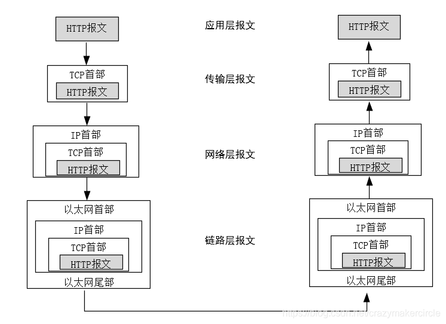
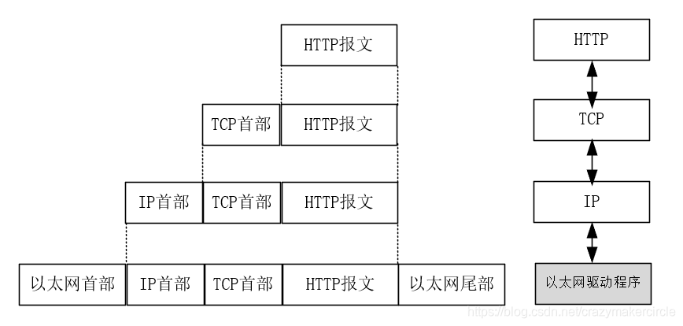
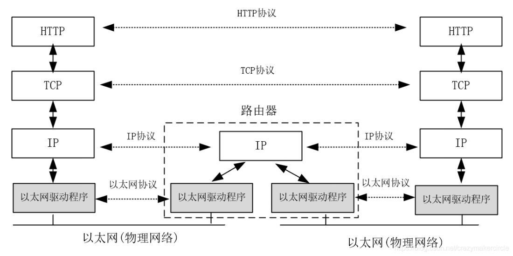

利用 TCP/IP 进行网络通信时，数据包会按照分层顺序与对方进行通信。发送端从应用层往下走，接收端从链路层往上走。从客户端到服务器的数据，每一帧数据的传输的顺序都为：**应用层->运输层->网络层->链路层->链路层->网络层->运输层->应用层。**

### HTTP 报文传输过程

以一个 HTTP 请求的传输为例，请求从 HTTP 客户端（如浏览器）和 HTTP 服务端应用的传输过程，大致如下图所示：

### 数据封装和分用

接下来，为大家介绍一下数据封装和分用。
数据通过互联网传输的时候不可能是光秃秃的不加标识，如果这样数据就会乱。

所以数据在发送的时候，需要加上特定标识，**加上特定标识的过程叫做数据的封装**，在数据使用的时候再去掉特定标识，**去掉特定标识的过程就叫做分用**。TCP/IP 协议的数据封装和分用过程，大致如下图所示：

在数据封装时，数据经过每个层都会打上该层特定标识，添加上头部。
在传输层封装时，添加的报文首部时要存入一个应用程序的标识符，**无论 TCP 和 UDP 都用一个 16 位的端口号来表示不同的应用程序，并且都会将源端口和目的端口存入报文首部中**。
在网络层封装时，IP 首部会标识处理数据的协议类型，或者说标识出网络层数据帧所携带的上层数据类型，如 TCP、UDP、ICMP、IP、IGMP 等等。
具体来说，会在 IP 首部中存入一个长度为 8 位的数值，称作协议域：
1 表示为 ICMP 协议、2 表示为 IGMP 协议、6 表示为 TCP 协议、17 表示为 UDP 协议、等等。IP 首部还会标识发送方地址（源 IP）和接收方地址（目标 IP）。

在链路层封装时，网络接口分别要发送和接收 IP、ARP 和 RARP 等多种不同协议的报文，因此也必须在以太网的帧首部中加入某种形式的标识，以指明所处理的协议类型，为此，以太网的报文帧的首部也有一个 16 位的类型域，标识出以太网数据帧所携带的上层数据类型，如 IPv4、ARP、IPV6、PPPoE 等等。

数据封装和分用的过程大致为：<strong style="color:red">发送端每通过一层会增加该层的首部，接收端每通过一层则删除该层的首部。</strong>

总体来说，TCP/IP 分层管理、数据封装和分用的好处：分层之后若需改变相关设计，只需替换变动的层。各层之间的接口部分规划好之后，每个层次内部的设计就可以自由改动。层次化之后，设计也变得相对简单：各个层只需考虑分派给自己的传输任务。

TCP/IP 与 OSI 的区别主要有哪些呢？**除了 TCP/IP 与 OSI 在分层模块上稍有区别，更重要的区别为：OSI 参考模型注重“通信协议必要的功能是什么”，而 TCP/IP 则更强调“在计算机上实现协议应该开发哪种程序”。**

实际上，在传输过程中，数据报文会在不同的物理网络之间传递，还是以一个 HTTP 请求的传输为例，请求在不同物理网络之间的传输过程，大致如下图所示：

数据包在不同物理网络之间的传输过程中，网络层会通过路由器去对不同的网络之间的数据包进行存储、分组转发处理。构造互连网最简单的方法是把两个或多个网络通过路由器进行连接。路由器可以简单理解为一种特殊的用于网络互连的硬件盒，其作用是为不同类型的物理网络提供连接：以太网、令牌环网、点对点的链接和 FDDI（光纤分布式数据接口）等等。

物理网络之间通过路由器进行互连，随着增加不同类型的物理网络，可能会有很多个路由器，但是对于应用层来说仍然是一样的，TCP 协议栈为大家屏蔽了物理层的复杂性。总之，物理细节和差异性的隐藏，使得互联网 TCP/IP 传输的功能变得非常强大。
