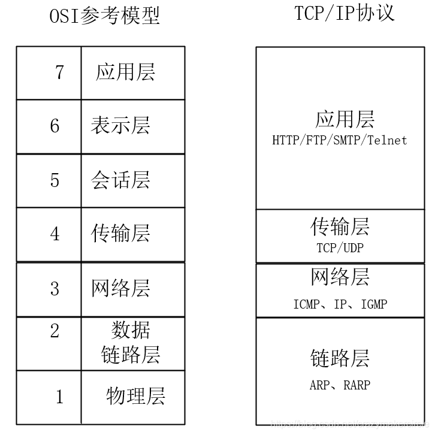

**TCP/IP协议的分层模型**
在展开介绍TCP/IP协议之前，首先介绍一下七层ISO模型。国际标准化组织ISO为了使网络应用更为普及，推出了OSI参考模型，即开放式系统互联（Open
System Interconnect）模型，
一般都叫OSI参考模型。OSI参考模型是ISO组织在1985年发布的网络互连模型，其含义就是为所有公司使用一个统一的规范来控制网络，这样所有公司遵循相同的通信规范，网络就能互联互通了。

**OSI模型的七层框架**
OSI模型定义了网络互连的七层框架**（物理层、数据链路层、网络层、传输层、会话层、表示层、应用层）**，每一层实现各自的功能和协议，并完成与相邻层的接口通信。OSI模型各层的通信协议，大致举例如下表所示：
| **应用层** | **HTTP、SMTP、SNMP、FTP、Telnet、SIP、SSH、NFS、RTSP、XMPP、Whois、ENRP、等等** |
|----|----|
| 表示层 | XDR、ASN.1、SMB、AFP、NCP、等等 |
| 会话层 | ASAP、SSH、RPC、NetBIOS、ASP、Winsock、BSD Sockets、等等 |
| 传输层 | TCP、UDP、TLS、RTP、SCTP、SPX、ATP、IL、等等 |
| 网络层 | IP、ICMP、IGMP、IPX、BGP、OSPF、RIP、IGRP、EIGRP、ARP、RARP、X.25、等等 |
| 数据链路层 | 以太网、令牌环、HDLC、帧中继、ISDN、ATM、IEEE 802.11、FDDI、PPP、等等 |
| 物理层 | 例如铜缆、网线、光缆、无线电等等 |
TCP/IP协议是Internet互联网最基本的协议，其在一定程度上参考了七层ISO模型。OSI模型共有七层，从下到上分别是物理层、数据链路层、网络层、运输层、会话层、表示层和应用层。但是这显然是有些复杂的，所以在TCP/IP协议中，七层被简化为了四个层次。**TCP/IP模型中的各种协议，依其功能不同，被分别归属到这四层之中，常被视为是简化过后的七层OSI模型**。

**TCP/IP协议与七层ISO模型的对应关系**
TCP/IP协议与七层ISO模型的对应关系，大致如下图所示：

TCP/IP协议:
- 应用层的主要协议有HTTP、Telnet、FTP、SMTP等，是用来读取来自传输层的数据或者将数据传输写入传输层；
- 传输层的主要协议有UDP、TCP，实现端对端的数据传输；
- 网络层的主要协议有ICMP、IP、IGMP，主要负责网络中数据包的传送等；
- 链路层有时也称作数据链路层或网络接口层，主要协议有ARP、RARP，

通常包括操作系统中的设备驱动程序和计算机中对应的网络接口卡，它们一起处理与传输媒介（如电缆或其他物理设备）的物理接口细节。

### （一）TCP/IP协议的应用层
应用层包括所有和应用程序协同工作，并利用基础网络交换应用程序的业务数据的协议。一些特定的程序被认为运行在这个层上，该层协议所提供的服务能直接支持用户应用。
应用层协议包括**HTTP（万维网服务）、FTP（文件传输）、SMTP（电子邮件）、SSH（安全远程登陆）、DNS（域名解析）**以及许多其他协议。
### （二）TCP/IP协议的传输层
传输层的协议，解决了诸如端到端可靠性问题，能确保数据可靠的到达目的地，甚至能保证数据按照正确的顺序到达目的地。传输层的主要功能大致如下：
（1）为端到端连接提供传输服务；
（2）这种传输服务分为可靠和不可靠的，其中TCP是典型的可靠传输，而UDP则是不可靠传输；
（3）为端到端连接提供流量控制、差错控制、QoS(Quality of
Service)服务质量等管理服务。
传输层主要有两个性质不同的协议：**TCP传输控制协议和UDP用户数据报协议。**
- TCP协议是一个面向连接的、可靠的传输协议，它提供一种可靠的字节流，能保证数据完整、无损并且按顺序到达。TCP尽量连续不断地测试网络的负载并且控制发送数据的速度以避免网络过载。另外，TCP试图将数据按照规定的顺序发送。
- UDP协议是一个无连接的数据报协议，是一个“尽力传递”和“不可靠”协议，不会对数据包是否已经到达目的地进行检查，并且不保证数据包按顺序到达。
- 总体来说，TCP协议传输效率低，但可靠性强；UDP协议传输效率高，但可靠性略低，适用于传输可靠性要求不高、体量小的数据（比如QQ聊天数据）。
### （三）TCP/IP协议的网络层
TCP/IP协议网络层的作用是在复杂的网络环境中为要发送的数据报找到一个合适的路径进行传输。
简单来说，网络层负责将数据传输到目标地址，目标地址可以是多个网络通过路由器连接而成的某一个地址。另外，网络层负责寻找合适的路径到达对方计算机，并把数据帧传送给对方，网络层还可以实现拥塞控制、网际互连等功能。网络层协议的代表包括：I**CMP、IP、IGMP**等。
### （四）TCP/IP协议的链路层
链路层有时也称作数据链路层或网络接口层，用来处理连接网络的硬件部分。该层既包括操作系统硬件的设备驱动、NIC（网卡）、光纤等物理可见部分，还包括连接器等一切传输媒介。在这一层，数据的传输单位为比特。其主要协议有ARP、RARP等。
