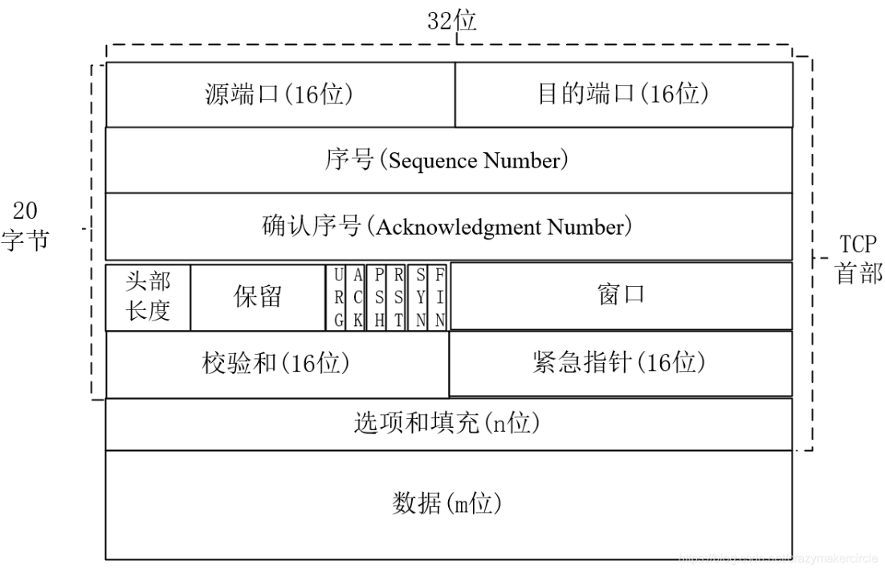
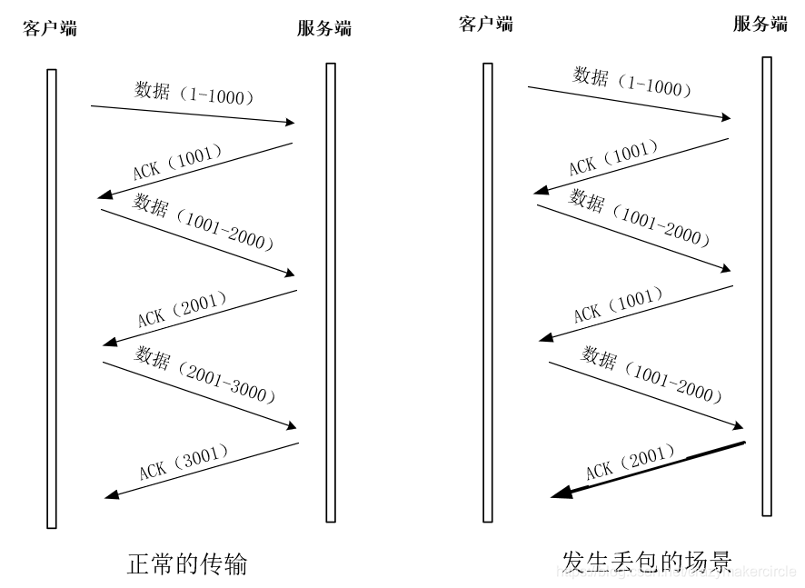
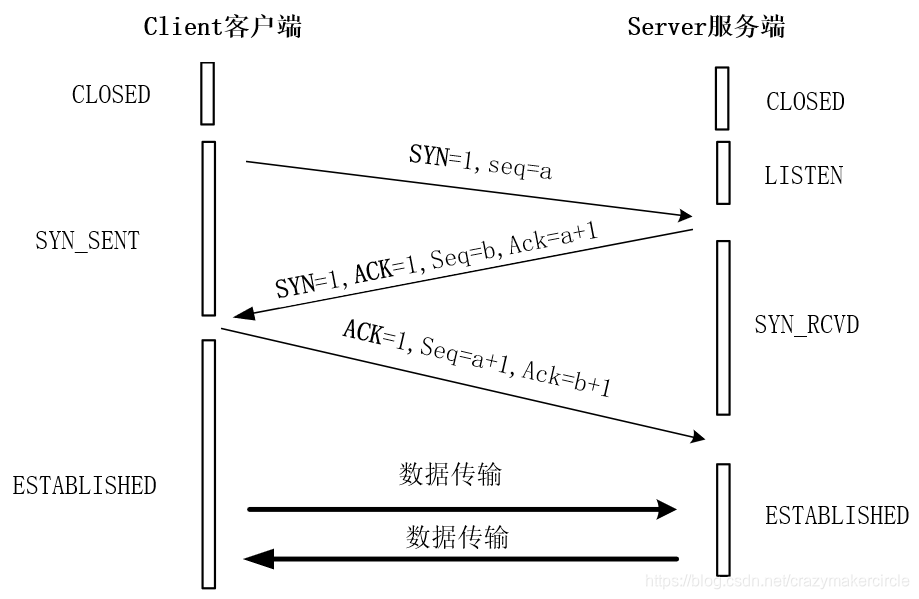
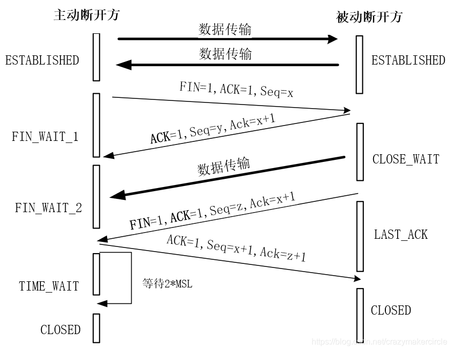
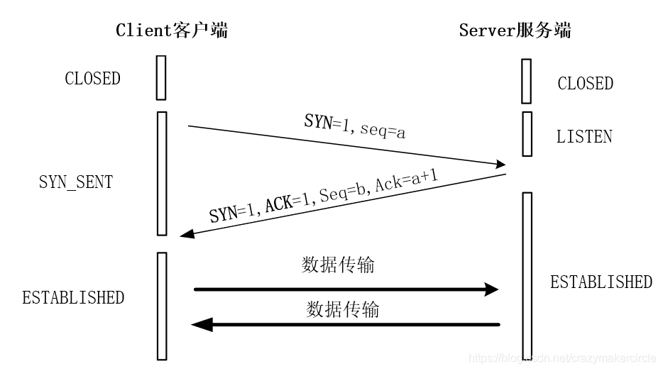

在TCP/IP协议栈中，IP协议层只关心数据能够跨越本地网络边界的问题，而不关心数据如何传输。
如图传输层TCP协议的数据帧。

#### （1）源端口号
表示报文的发送端口，占16位。源端口和源IP地址结合
#### （2）目的端口号
占16位。目的端口和目的IP地址结合
TCP协议是基于IP协议的基础上传输的。
#### （3）序号
在发送端出的字节流中，传输报文中的数据部分的每一个字节都有它的编号。在数据传输过程中，TCP协议通过序号对上层提供有序的数据流。
#### （4）确认序号
标识了报文接收端期望接收的字节序列。如果设置ACK控制位，确认序号的值表示一个准备接收的包的序列码，所指向的是准备接收的包，即下一个期望接收的包的序列码

#### （5）头部长度
占4位，表示TCP报文首部的长度，
#### （7）控制标志

| **标志位** | **说明** |
|----|----|
| URG | 占1位，表示紧急指针字段有效。URG位指示报文段里的上层实体（数据）标记为“紧急”数据。当URG=1时，其后的紧急指针指示紧急数据在当前数据段中的位置(相对于当前序列号的字节偏移量)，TCP接收方必须通知上层实体。 |
| ACK | 占1位，置位ACK=1表示确认号字段有效；TCP协议规定，接建立后所有发送的报文的ACK必须为1；当ACK=0时，表示该数据段不包含确认信息。当ACK=1时，表示该报文段包括一个对已被成功接收报文段的确认序号Acknowledgment Number，该序号同时也是下一个报文的预期序号。 |
| PSH | 占1位，表示当前报文需要请求推（push）操作；当PSH=1时，接收方在收到数据后立即将数据交给上层，而不是直到整个缓冲区满。 |
| RST | 占1位，置位RST=1表示复位TCP连接；用于重置一个已经混乱的连接，也可用于拒绝一个无效的数据段或者拒绝一个连接请求。如果数据段被设置了RST位，说明报文发送方有问题发生。 |
| SYN | 占1位，在连接建立时用来同步序号。**当SYN=1而ACK=0时，表明这是一个连接请求报文。对方若同意建立连接，则应在响应报文中使SYN=1和ACK=1。** 综合一下，SYN置1就表示这是一个连接请求或连接接受报文。 |
| FIN | 占1位，用于在释放TCP连接时，标识发送方比特流结束，用来释放一个连接。当 FIN = 1时，表明此报文的发送方的数据已经发送完毕，并要求释放连接。 |

### TCP的三次握手
#### 三次握手过程
TCP连接的建立时，双方需要经过三次握手，具体过程如下：
（1）第一次握手：Client进入SYN_SENT状态，发送一个SYN帧来主动打开传输通道，该帧的SYN标志位被设置为1，同时会带上Client分配好的SN序列号，该SN是根据时间产生的一个随机值，通常情况下每间隔4ms会加1。除此之外，SYN帧还会带一个MSS（最大报文段长度）可选项的值，表示客户端发送出去的最大数据块的长度。

（2）第二次握手：Server端在收到SYN帧之后，会进入SYN_RCVD状态，同时返回SYN+ACK帧给Client，主要目的在于通知Client，Server端已经收到SYN消息，现在需要进行确认。Server端发出的SYN+ACK帧的ACK标志位被设置为1，其确认序号AN（Acknowledgment
Number）值被设置为Client的SN+1；SYN+ACK帧的SYN标志位被设置为1，SN值为Server端生成的SN序号；SYN+ACK帧的MSS（最大报文段长度）表示的是Server端的最大数据块长度。

（3）第三次握手：Client在收到Server的第二次握手SYN+ACK确认帧之后，首先将自己的状态会从SYN_SENT变成ESTABLISHED，表示自己方向的连接通道已经建立成功，Client可以发送数据给Server端了。然后，Client发ACK帧给Server端，该ACK帧的ACK标志位被设置为1，其确认序号AN（Acknowledgment
Number）值被设置为Server端的SN序列号+1。还有一种情况，Client可能会将ACK帧和第一帧要发送的数据，合并到一起发送给Server端。
（4）Server端在收到Client的ACK帧之后，会从SYN_RCVD状态会进入ESTABLISHED状态，至此，Server方向的通道连接建立成功，Server可以发送数据给Client，TCP的全双工连接建立完成。

### TCP的四次挥手
#### 四次挥手具体过程
四次挥手具体过程，具体如下：
（1）第一次挥手：主动断开方（可以是客户端，也可以是服务器端），向对方发送一个FIN结束请求报文，此报文的FIN位被设置为1，并且正确设置Sequence
Number（序列号）和Acknowledgment
Number（确认号）。发送完成后，主动断开方进入FIN_WAIT_1状态，这表示主动断开方没有业务数据要发送给对方，准备关闭SOCKET连接了。

（2）第二次挥手：正常情况下，在收到了主动断开方发送的FIN断开请求报文后，被动断开方会发送一个ACK响应报文，报文的Acknowledgment
Number（确认号）值为断开请求报文的Sequence Number
（序列号）加1，该ACK确认报文的含义是：“我同意你的连接断开请求”。之后，被动断开方就进入了CLOSE-WAIT（关闭等待）状态，TCP协议服务会通知高层的应用进程，对方向本地方向的连接已经关闭，对方已经没有数据要发送了，若本地还要发送数据给对方，对方依然会接受。被动断开方的CLOSE-WAIT（关闭等待）还要持续一段时间，也就是整个CLOSE-WAIT状态持续的时间。
主动断开方在收到了ACK报文后，由FIN_WAIT_1转换成FIN_WAIT_2状态。

（3）第三次挥手：在发送完成ACK报文后，被动断开方还可以继续完成业务数据的发送，待剩余数据发送完成后，或者CLOSE-WAIT（关闭等待）截止后，被动断开方会向主动断开方发送一个FIN+ACK结束响应报文，表示被动断开方的数据都发送完了，然后，被动断开方进入LAST_ACK状态。

（4）第四次挥手：主动断开方收在到FIN+ACK断开响应报文后，还需要进行最后的确认，向被动断开方发送一个ACK确认报文，然后，自己就进入TIME_WAIT状态，等待超时后最终关闭连接。处于TIME_WAIT状态的主动断开方，在等待完成2MSL的时间后，如果期间没有收到其他报文，则证明对方已正常关闭，主动断开方的连接最终关闭。

#### 问题（1）：为什么关闭连接的需要四次挥手，而建立连接却只要三次握手呢？
关闭连接时，被动断开方在收到对方的FIN结束请求报文时，很可能业务数据没有发送完成，并不能立即关闭连接，被动方只能先回复一个ACK响应报文，告诉主动断开方：“你发的FIN报文我收到了，只有等到我所有的业务报文都发送完了，我才能真正的结束，在结束之前，我会发你FIN+ACK报文的，你先等着”。所以，被动断开方的确认报文，需要拆开成为两步，故总体就需要四步挥手。

而在建立连接场景中，Server端的应答可以稍微简单一些。当Server端收到Client端的SYN连接请求报文后，其中ACK报文表示对请求报文的应答，SYN报文用来表示服务端的连接也已经同步开启了，而ACK报文和SYN报文之间，不会有其他报文需要发送，故而可以合二为一，可以直接发送一个SYN+ACK报文。所以，在建立连接时，只需要三次握手即可。
#### 问题（2）：为什么连接建立的时候是三次握手，可以改成两次握手吗？
三次握手完成两个重要的功能：一是双方都做好发送数据的准备工作，而且双方都知道对方已准备好；二是双方完成初始SN序列号的协商，双方的SN序列号在握手过程中被发送和确认。

如果把三次握手改成两次握手，可能发生死锁。两次握手的话，缺失了Client的二次确认ACK帧，假想的TCP建立的连接时二次挥手，可以如下图所示：

在假想的TCP建立的连接时二次握手过程中，Client发送Server发送一个SYN请求帧，Server收到后发送了确认应答SYN+ACK帧。按照两次握手的协定，Server认为连接已经成功地建立了，可以开始发送数据帧。这个过程中，如果确认应答SYN+ACK帧在传输中被丢失，Client没有收到，Client将不知道Server是否已准备好，也不知道Server的SN序列号，Client认为连接还未建立成功，将忽略Server发来的任何数据分组，会一直等待Server的SYN+ACK确认应答帧。**而Server在发出的数据帧后，一直没有收到对应的ACK确认后就会产生超时，重复发送同样的数据帧。这样就形成了死锁。**

#### 问题（3）：为什么主动断开方在TIME-WAIT状态必须等待2MSL的时间？
原因之一：主动断开方等待2MSL的时间，是为了<strong style="color:red">确保两端都能最终关闭。</strong>假设网络是不可靠的，被动断开方发送FIN+ACK报文后，其主动方的ACK响应报文有可能丢失，这时候的**被动断开方处于LAST-ACK状态的，由于收不到ACK确认被动方一直不能正常的进入CLOSED状态**。在这种场景下，被动断开方会超时重传FIN+ACK断开响应报文，如果主动断开方在2MSL时间内，收到这个重传的FIN+ACK报文，会重传一次ACK报文，后再一次重新启动2MSL计时等待，这样，就能确保被动断开方能收到ACK报文，从而能确保被动方顺利进入到CLOSED状态。只有这样，双方都能够确保关闭。反过来说，`如果主动断开方在发送完ACK响应报文后，不是进入TIME_WAIT状态去等待2MSL时间，而是立即释放连接，则将无法收到被动方重传的FIN+ACK报文，所以不会再发送一次ACK确认报文，此时处于LAST-ACK状态的被动断开方，无法正常进入到CLOSED状态。`

原因之二：<strong style="color:red">防止“旧连接的已失效的数据报文”出现在新连接中。</strong>主动断开方在发送完最后一个ACK报文后，再经过2MSL，才能最终关闭和释放端口，**这就意味着，相同端口的新TCP新连接，需要在2MSL的时间之后，才能够正常的建立**。2MSL这段时间内，旧连接所产生的所有数据报文，都已经从网络中消失了，从而，确保了下一个新的连接中不会出现这种旧连接请求报文。

#### 问题（4）：如果已经建立了连接，但是Client端突然出现故障了怎么办？
TCP还设有一个保活计时器，Client端如果出现故障，Server端不能一直等下去，这样会浪费系统资源。每收到一次Client客户端的数据帧后，Server端都的保活计时器会复位。计时器的超时时间通常是设置为2小时，若2小时还没有收到Client端的任何数据帧，Server端就会发送一个探测报文段，以后每隔75秒钟发送一次。若一连发送10个探测报文仍然没反应，Server端就认为Client端出了故障，接着就关闭连接。如果觉得保活计时器的两个多小时的间隔太长，可以自行调整TCP连接的保活参数。

