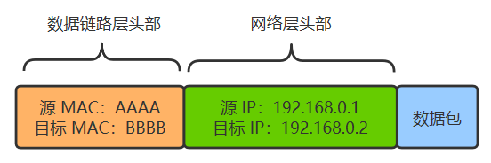

### IP地址的诞生
我们先从现实中 MAC 地址的结构入手，**MAC地址也叫物理地址、硬件地址，长度为 48 位，一般这样来表示**
>**00-16-EA-AE-3C-40**

它是由网络设备制造商生产时烧录在网卡的EPROM（一种闪存芯片，通常可以通过程序擦写）。
其中**前 24 位（00-16-EA）代表网络硬件制造商的编号**，后 24 位（AE-3C-40）是该厂家自己分配的，一般表示系列号。

只要不更改自己的 MAC 地址，MAC 地址在世界是唯一的。形象地说，MAC地址就如同身份证上的身份证号码，具有`唯一性`。

那如果你希望向上面那样表示将目标 MAC 地址为**FFFF-FFFF-？开头的**，统一从路由器出去发给某一群设备（后面会提到这其实是子网的概念），那你就需要要求某一子网下统统买一个厂商制造的设备，要么你就需要要求厂商在生产网络设备烧录 MAC 地址时，提前按照你规划好的子网结构来定 MAC 地址，并且日后这个网络的结构都不能轻易改变。
这显然是不现实的。

于是你发明了一个新的地址，给每一台机器一个 32 位的编号，如：
>**11000000101010000000000000000001**

你觉得有些不清晰，于是把它分成四个部分，中间用点相连。
>**11000000.10101000.00000000.00000001**

你还觉得不清晰，于是把它转换成 10 进制。
>**192.168.0.1**

最后你给了这个地址一个响亮的名字，**IP 地址**。现在每一台电脑，同时有自己的 MAC 地址，又有自己的 IP 地址，只不过 IP 地址是**软件层面**上的，可以随时修改，MAC 地址一般是无法修改的。

**现在两个设备之间传输，除了加上数据链路层的头部之外，还要再增加一个网络层的头部。**

假如 A 给 B 发送数据，由于它们直接连着交换机，所以 A 直接发出如下数据包即可，其实网络层没有体现出作用。

### 子网的由来
**A 给 C 发数据包，怎么知道是否要通过路由器转发呢？**
**答案：子网**

如果源 IP 与目的 IP 处于一个子网，直接将包通过交换机发出去。

如果源 IP 与目的 IP 不处于一个子网，就交给路由器去处理。

好，那现在只需要解决，什么叫处于一个子网就好了。
- 192.168.0.1 和 192.168.0.2 处于同一个子网
- 192.168.0.1 和 192.168.1.1 处于不同子网
  
这两个是我们人为规定的，即我们想表示，对于 192.168.0.1 来说：
**192.168.0.xxx 开头的，就算是在一个子网，否则就是在不同的子网。**

那对于计算机来说，怎么表达这个意思呢？于是人们发明了**子网掩码**的概念
假如某台机器的子网掩码定为 255.255.255.0
这表示，将源 IP 与目的 IP 分别同这个子网掩码进行**与运算**，相等则是在一个子网，不相等就是在不同子网**，就这么简单。
比如
- **A电脑**：192.168.0.1 & 255.255.255.0 = 192.168.0.0
- **B电脑**：192.168.0.2 & 255.255.255.0 = 192.168.0.0
- **C电脑**：192.168.1.1 & 255.255.255.0 = 192.168.1.0
- **D电脑**：192.168.1.2 & 255.255.255.0 = 192.168.1.0
那么 A 与 B 在同一个子网，C 与 D 在同一个子网，但是 A 与 C 就不在同一个子网，与 D 也不在同一个子网，以此类推。

