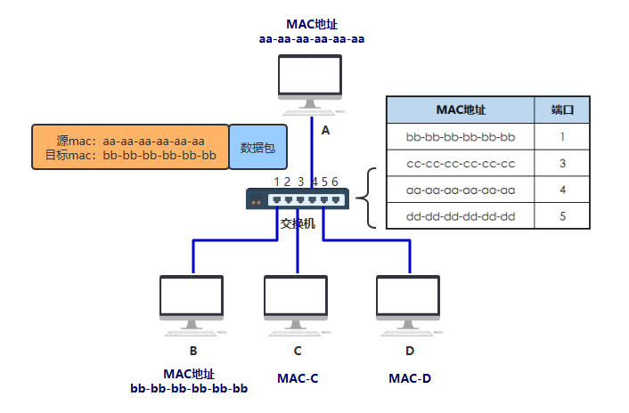
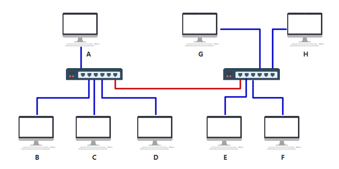

### 集线器的问题
如果把这个集线器弄得更智能一些，**只发给目标 MAC 地址指向的那台电脑**，就好了。

### 交换机的诞生
虽然只比集线器多了这一点点区别，但看起来似乎有智能了，你把这东西叫做**交换机**。也正因为这一点点智能，你把它放在了另一个层级，**数据链路层**。

如上图所示，你是这样设计的。
交换机内部维护一张**MAC 地址表**，记录着每一个 MAC 地址的设备，连接在其哪一个端口上。
| **MAC 地址**      | **端口** |
|-------------------|----------|
| bb-bb-bb-bb-bb-bb | 1        |
| cc-cc-cc-cc-cc-cc | 3        |
| aa-aa-aa-aa-aa-aa | 4        |
| dd-dd-dd-dd-dd-dd | 5        |
假如你仍然要发给 B 一个数据包，构造了如下的数据结构从网口出去。

到达交换机时，交换机内部通过自己维护的 MAC 地址表，发现**目标机器 B 的 MAC 地址 bb-bb-bb-bb-bb-bb 映射到了端口 1 上**，于是把数据从 1 号端口发给了 B，完事~
你给这个通过这样传输方式而组成的小范围的网络，叫做**以太网**。
当然最开始的时候，MAC 地址表是空的，是怎么逐步建立起来的呢？
假如在 MAC 地址表为空是，你给 B 发送了如下数据
由于这个包从端口 4 进入的交换机，所以此时交换机就可以在 MAC地址表记录第一条数据：
**MAC：aa-aa-aa-aa-aa-aa-aa**
**端口：4**
交换机看目标 MAC 地址（bb-bb-bb-bb-bb-bb）在地址表中并没有映射关系，于是将此包发给了**所有端口**，也即发给了所有机器。
之后，只有机器 B 收到了确实是发给自己的包，于是做出了**响应**，响应数据从端口 1 进入交换机，于是交换机此时在地址表中更新了第二条数据：
**MAC：bb-bb-bb-bb-bb-bb**
**端口：1**
过程如下

经过该网络中的机器不断地通信，交换机最终将 MAC 地址表建立完毕~
随着机器数量越多，交换机的端口也不够了，但聪明的你发现，只要将多个交换机连接起来，这个问题就轻而易举搞定~

你完全不需要设计额外的东西，只需要按照之前的设计和规矩来，按照上述的接线方式即可完成所有电脑的互联，所以交换机设计的这种规则，真的很巧妙。你想想看为什么（比如 A 要发数据给 F）。
但是你要注意，上面那根红色的线，最终在 MAC 地址表中可不是一条记录呀，而是要把 EFGH 这四台机器与该端口（端口6）的映射全部记录在表中。
#### MAC 地址和端口的映射记录
最终，**两个交换机将分别记录 A ~ H 所有机器的映射记录**。
**左边的交换机**
| **MAC 地址**      | **端口** |
|-------------------|----------|
| bb-bb-bb-bb-bb-bb | 1        |
| cc-cc-cc-cc-cc-cc | 3        |
| aa-aa-aa-aa-aa-aa | 4        |
| dd-dd-dd-dd-dd-dd | 5        |
| ee-ee-ee-ee-ee-ee | 6        |
| ff-ff-ff-ff-ff-ff | 6        |
| gg-gg-gg-gg-gg-gg | 6        |
| hh-hh-hh-hh-hh-hh | 6        |
**右边的交换机**
| **MAC 地址**      | **端口** |
|-------------------|----------|
| bb-bb-bb-bb-bb-bb | 1        |
| cc-cc-cc-cc-cc-cc | 1        |
| aa-aa-aa-aa-aa-aa | 1        |
| dd-dd-dd-dd-dd-dd | 1        |
| ee-ee-ee-ee-ee-ee | 2        |
| ff-ff-ff-ff-ff-ff | 3        |
| gg-gg-gg-gg-gg-gg | 4        |
| hh-hh-hh-hh-hh-hh | 6        |
这在只有 8 台电脑的时候还好，甚至在只有几百台电脑的时候，都还好，所以这种交换机的设计方式，已经足足支撑一阵子了。
但很遗憾，人是贪婪的动物，很快，电脑的数量就发展到几千、几万、几十万。
