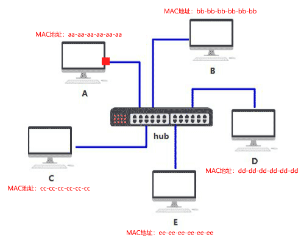

### 集线器的诞生
于是你们发明了一个中间设备，你们将网线都插到这个设备上，由这个设备做转发，就可以彼此之间通信了，本质上和原来一样，只不过网口的数量和网线的数量减少了，不再那么混乱。

你给它取名叫**集线器**，它仅仅是无脑将电信号**转发到所有出口（广播）**，不做任何处理，你觉得它是没有智商的，因此把人家定性在了**物理层**。

由于转发到了所有出口，那 BCDE 四台机器怎么知道数据包是不是发给自己的呢？
首先，你要给所有的连接到交换机的设备，都起个名字。原来你们叫 ABCD，但现在需要一个更专业的，**全局唯一**的名字作为标识，你把这个更高端的名字称为**MAC 地址**。
你的 MAC 地址是 aa-aa-aa-aa-aa-aa，你的伙伴 b 的 MAC 地址是 bb-bb-bb-bb-bb-bb，以此类推，不重复就好。
这样，A 在发送数据包给 B 时，只要在头部拼接一个这样结构的数据，就可以了。

B 在收到数据包后，根据头部的目标 MAC 地址信息，判断这个数据包的确是发给自己的，于是便**收下**。
其他的 CDE 收到数据包后，根据头部的目标 MAC 地址信息，判断这个数据包并不是发给自己的，于是便**丢弃**。

虽然集线器使整个布局干净不少，但原来我只要发给电脑 B 的消息，现在却要发给连接到集线器中的所有电脑，这样既不安全，又不节省网络资源。
